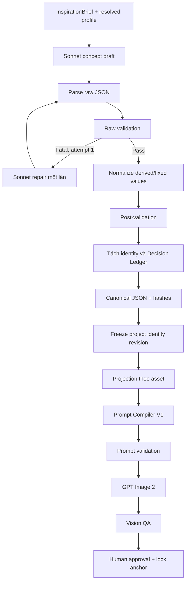

# PHƯƠNG ÁN PRODUCTION-GRADE CHỐT

## Sonnet Concept Governance + Prompt Compiler V1 đã kiểm chứng

Phiên bản kiến trúc: `concept-governance/1.0`

Phạm vi đầu tiên: `superyacht`

Mục tiêu của phương án này là bổ sung kiểm soát dữ liệu trước khi render mà không làm thay đổi Prompt Compiler V1 và render flow đã cho kết quả ảnh tốt.

> **Sonnet tạo concept draft hiện tại → Laravel raw validation theo schema/profile/cross-check → repair đúng một lần nếu fatal → normalize và post-validation → tách Decision Ledger → canonicalize, hash và freeze project identity → compatibility projection theo asset → Python Prompt Compiler V1 đã kiểm chứng → prompt validation → GPT Image 2 render → Vision QA → human approval và khóa anchor.**

---

# 1. Quyết định kiến trúc bắt buộc

## 1.1. Giữ nguyên những gì đã render tốt

Trong đợt triển khai này không thay đổi:

- cấu trúc section và thứ tự section của Prompt Compiler V1;
- `AssetRenderPlan` và dependency giữa các asset;
- camera profiles;
- construction state profiles;
- reference-role mapping;
- identity-preserving edit flow;
- fabrication-state compiler;
- construction delta compiler;
- hard constraints và avoid policy;
- GPT Image adapter;
- kích thước, quality và provider parameters đã kiểm chứng.

Mọi thay đổi upstream chỉ được đưa vào production nếu compatibility projection tạo ra prompt bằng hoặc tương đương semantic với baseline đã duyệt.

## 1.2. Không xây hệ thống song song

Tận dụng các thành phần đang có:

| Nhu cầu | Thành phần hiện có cần mở rộng |
|---|---|
| Chọn profile | `CreativeProfileResolver` |
| Contract theo category | `CategoryCreativeProfile` |
| Khai báo identity | `identitySlots` |
| Cross-field rules | `identity_cross_checks` |
| Sinh concept | `ClaudeConceptDesigner` |
| Parse output | `CreativeConceptParser` |
| Validation | `ConceptValidator` |
| Chuẩn hóa | `canonicalised($profile)` — tách thành normalizer rõ trách nhiệm |
| Lưu identity cấp project | `visual_identities` |
| Compile prompt | Python Prompt Compiler V1 |

Không tạo thêm `SchemaRegistry`, `ProfileRegistry` hoặc hệ `invariants` thứ hai nếu chức năng đó có thể được bổ sung vào các thành phần trên.

## 1.3. Sonnet và Laravel là hai authority khác nhau

| Thành phần | Authority |
|---|---|
| Sonnet | quyết định semantic design và provenance |
| Laravel profile | fixed values, allowed values, numeric bounds |
| Laravel validator | tính hợp lệ và mâu thuẫn xuyên trường |
| Laravel normalizer | derived values và canonical representation |
| Frozen project identity | canonical design truth cho mọi session |
| Python Compiler V1 | biên dịch đúng lát cắt thành provider prompt |
| Vision QA | kiểm kết quả ảnh theo view/asset |
| Người dùng | chọn canonical anchor |

Laravel không tự sửa quyết định hình học mâu thuẫn. Sonnet được repair đúng một lần; nếu vẫn sai, stage thất bại rõ ràng.

---

# 2. Luồng dữ liệu chốt



Trình tự bắt buộc:

```text
parse raw
→ validate raw
→ repair nếu fatal
→ normalize
→ validate normalized
→ canonicalize
→ freeze
→ projection
→ compile
```

Không được:

```text
parse → canonicalise trước → mới validate raw
projection → rồi mới freeze
Python tự sửa DesignSpec
Laravel đoán cách sửa geometry mâu thuẫn
```

---

# 3. Phase 0 — Khóa golden baseline

## 3.1. Mục đích

Lưu một concept, prompt và ảnh đã được người dùng đánh giá tốt. Đây là regression contract bảo vệ chất lượng render trong toàn bộ đợt refactor.

## 3.2. Fixture cần tạo

```text
tests/Fixtures/concept/golden_superyacht/
├── inspiration_input.json
├── raw_concept_response.json
├── canonical_concept.json
├── geometry_projection.json
├── compiled_prompt.txt
├── prompt_sections.json
├── render_request.json
├── qa_expectations.json
└── metadata.json
```

`metadata.json`:

```json
{
  "instruction_version": "concept-v18",
  "profile_code": "faceted_continuous_envelope",
  "profile_version": "1.0",
  "projection_version": "geometry-projection/1.0",
  "compiler_version": "prompt-compiler-v1",
  "template_version": "master-vessel-geometry-v1",
  "provider": "openai",
  "model": "gpt-image-2",
  "quality": "high",
  "size": "1536x1024"
}
```

## 3.3. Test baseline

```php
it('locks the known-good geometry prompt', function () {
    $prompt = file_get_contents(
        base_path('tests/Fixtures/concept/golden_superyacht/compiled_prompt.txt')
    );

    expect(hash('sha256', $prompt))
        ->toBe(config('video.tests.known_good_geometry_prompt_sha256'));
});
```

## 3.4. Tiêu chí hoàn thành

- Có raw concept đã dùng thật.
- Có compiled prompt đã render tốt.
- Có prompt SHA-256.
- Có provider request chính xác.
- Có ảnh approved và QA expectations.
- Chưa sửa bất kỳ production behavior nào.

---

# 4. Phase 1 — Version hóa profile hiện tại

## 4.1. Không dùng `instruction_version` làm `schema_version`

Hai giá trị có ý nghĩa khác nhau:

```text
instruction_version = prompt Sonnet nào đã được dùng
schema_version      = output contract nào đã được dùng
```

Ví dụ:

```text
instruction_version = concept-v18
schema_version      = creative-concept/1.0
```

## 4.2. Mở rộng `CategoryCreativeProfile`

```php
final readonly class CategoryCreativeProfile
{
    public function __construct(
        public string $code,
        public string $version,
        public string $objectType,
        public array $identitySlots,
        public array $inspectionAspects,
        public array $viewpointGuidance,
        public array $conceptAntipatterns,
        public array $conceptForbiddenTerms,
        public array $fixedValues = [],
        public array $allowedValues = [],
        public array $identityCrossChecks = [],
    ) {}

    public function toContractArray(): array
    {
        return [
            'code' => $this->code,
            'version' => $this->version,
            'object_type' => $this->objectType,
            'identity_slots' => $this->identitySlots,
            'fixed_values' => $this->fixedValues,
            'allowed_values' => $this->allowedValues,
            'identity_cross_checks' => $this->identityCrossChecks,
        ];
    }
}
```

## 4.3. Profile hash

```php
final class CreativeProfileHasher
{
    public function __construct(
        private readonly CanonicalJson $canonicalJson,
    ) {}

    public function hash(CategoryCreativeProfile $profile): string
    {
        return hash(
            'sha256',
            $this->canonicalJson->encode($profile->toContractArray())
        );
    }
}
```

## 4.4. Phân loại profile rule

```php
'fixed_values' => [
    'design_identity.openings.distribution' => 'horizontal_ribbon',
    'design_identity.superstructure.external_read' => 'single_integrated_mass',
],

'allowed_values' => [
    'design_identity.bow.stem' => [
        'near_plumb',
        'raked',
    ],
    'design_identity.openings.vertical_extent' => [
        'partial_height',
        'mixed_by_zone',
    ],
],
```

Profile fixed value được đưa vào Sonnet instruction để giảm lỗi, nhưng Laravel vẫn là authority kiểm lại.

## 4.5. Tiêu chí hoàn thành

- Resolver hiện tại vẫn hoạt động.
- Mỗi profile có `code`, `version`, `objectType`.
- Có stable `profile_sha256`.
- Không tạo registry thứ hai.
- Output Sonnet chưa đổi.

---

# 5. Phase 2 — Chuẩn hóa violation và validation result

## 5.1. Cấu trúc thư mục

```text
app/Video/Concept/Validation/
├── ConceptValidationPipeline.php
├── ConceptShapeValidator.php
├── ConceptProfileValidator.php
├── ConceptCrossFieldValidator.php
├── ConceptSemanticProseValidator.php
├── ConceptValidationResult.php
├── ConceptViolation.php
└── CrossChecks/
    ├── CrossCheck.php
    ├── RatioCrossCheck.php
    ├── SumEqualsCrossCheck.php
    ├── CountMatchesCrossCheck.php
    ├── ConditionalRangeCrossCheck.php
    └── CrossCheckRegistry.php
```

## 5.2. `ConceptViolation`

```php
final readonly class ConceptViolation
{
    public function __construct(
        public string $code,
        public string $path,
        public string $message,
        public string $severity,
        public mixed $expected = null,
        public mixed $actual = null,
    ) {}

    public function isFatal(): bool
    {
        return $this->severity === 'fatal';
    }

    public function toArray(): array
    {
        return [
            'code' => $this->code,
            'path' => $this->path,
            'message' => $this->message,
            'severity' => $this->severity,
            'expected' => $this->expected,
            'actual' => $this->actual,
        ];
    }
}
```

## 5.3. Severity policy

Fatal:

- missing required identity slot;
- invalid type/enum/range;
- ratio mismatch;
- counted identity conflict;
- material structure contradiction;
- bow/stern contradiction;
- profile fixed-value violation;
- unsupported profile value;
- multi-storey glazing trái với separate aperture bands.

Warning:

- prose hơi dài;
- visibility claim chưa tối ưu nhưng không bất khả thi;
- provenance cần review;
- optional program chưa đầy đủ;
- lặp văn phong không làm đổi nghĩa identity.

## 5.4. Tiêu chí hoàn thành

- Violation có code ổn định, path, expected, actual.
- Retry không nhận một chuỗi lỗi mơ hồ.
- UI/log có thể hiển thị lỗi theo field.
- Các test cũ vẫn pass.

---

# 6. Phase 3 — Raw validation bốn lớp

## 6.1. `ConceptShapeValidator`

Kiểm:

- đúng 5 top-level field hiện tại;
- không có additional fields;
- đúng type;
- enum hợp lệ;
- numeric bounds;
- signature feature đúng shape;
- decisions đủ `inspectionAspects`;
- viewpoint thuộc allowlist.

Top-level contract vẫn giữ nguyên trong đợt đầu:

```json
{
  "design_thesis": "...",
  "design_identity": {},
  "form_relationships": {},
  "signature_features": [],
  "decisions": []
}
```

Không chuyển ngay sang một JSON envelope mới vì sẽ làm thay đổi hành vi Sonnet cùng lúc với validator.

## 6.2. `ConceptProfileValidator`

Kiểm `fixedValues`, `allowedValues`, viewpoint và structured antipatterns.

```php
private function validateFixedValues(
    array $payload,
    array $fixedValues,
): array {
    $violations = [];

    foreach ($fixedValues as $path => $expected) {
        $actual = data_get($payload, $path);

        if ($actual !== $expected) {
            $violations[] = new ConceptViolation(
                code: 'PROFILE_FIXED_VALUE_VIOLATION',
                path: $path,
                message: "Profile requires {$path} to equal {$expected}.",
                severity: 'fatal',
                expected: $expected,
                actual: $actual,
            );
        }
    }

    return $violations;
}
```

## 6.3. Mở rộng `identity_cross_checks`

Không thêm hệ `invariants` song song. Bổ sung các `kind`:

```text
ratio
sum_equals
count_matches
conditional_range
enum_compatible
material_assembly
semantic_exclusion
```

Ratio:

```php
[
    'code' => 'length_beam_ratio',
    'kind' => 'ratio',
    'numerator' => 'design_identity.design_length_m',
    'denominator' => 'design_identity.design_beam_m',
    'result' => 'design_identity.length_to_beam_ratio',
    'tolerance' => 0.08,
    'severity' => 'fatal',
]
```

Conditional range:

```php
[
    'code' => 'near_plumb_bow_rake',
    'kind' => 'conditional_range',
    'when' => [
        'path' => 'design_identity.bow.stem',
        'equals' => 'near_plumb',
    ],
    'target' => 'design_identity.bow.rake_degrees',
    'min' => 0,
    'max' => 10,
    'severity' => 'fatal',
]
```

Chỉ thêm `sum_equals` và `count_matches` khi các operand đã là structured fields. Không parse decision prose để tạo operand.

## 6.4. `ConceptSemanticProseValidator`

Bắt structured truth bị prose phủ định:

```text
six decks ≠ visible_deck_tiers 4
one ribbon ≠ aperture_bands 4
composite primary hull ≠ steel hull structure
continuous taper to stern ≠ full-beam transom
```

Number extractor phải nhận cả digit và English number words:

```php
private const NUMBER_WORDS = [
    'one' => 1,
    'two' => 2,
    'three' => 3,
    'four' => 4,
    'five' => 5,
    'six' => 6,
    'seven' => 7,
    'eight' => 8,
];
```

Phải map noun theo semantic slot:

```text
deck/tier/level → visible_deck_tiers
band/ribbon      → openings.aperture_bands
cabin            → capacity/guest_cabins, nếu field cấu trúc tồn tại
```

Không so mọi con số với deck count.

## 6.5. Validation pipeline

```php
final class ConceptValidationPipeline
{
    public function __construct(
        private readonly ConceptShapeValidator $shape,
        private readonly ConceptProfileValidator $profile,
        private readonly ConceptCrossFieldValidator $crossField,
        private readonly ConceptSemanticProseValidator $semantic,
    ) {}

    public function validateRaw(
        array $payload,
        CategoryCreativeProfile $profile,
    ): ConceptValidationResult {
        return new ConceptValidationResult([
            ...$this->shape->validate($payload, $profile),
            ...$this->profile->validate($payload, $profile),
            ...$this->crossField->validate($payload, $profile),
            ...$this->semantic->validate($payload, $profile),
        ]);
    }

    public function validateNormalized(
        array $payload,
        CategoryCreativeProfile $profile,
    ): ConceptValidationResult {
        return new ConceptValidationResult([
            ...$this->shape->validate($payload, $profile),
            ...$this->profile->validate($payload, $profile),
            ...$this->crossField->validate($payload, $profile),
        ]);
    }
}
```

## 6.6. Tiêu chí hoàn thành

- JSON `six decks / four tiers` bị fatal.
- Ratio sai bị fatal.
- Unsupported enum bị fatal.
- Fixed profile value bị đổi sẽ fatal.
- Validation chạy trên raw payload trước canonicalization.
- Chưa thay production return path; chạy shadow trước.

---

# 7. Phase 4 — Shadow mode trước khi hard-gate

## 7.1. Feature flags

```php
return [
    'concept_validation_v2' => env('CONCEPT_VALIDATION_V2', false),
    'concept_validation_enforce' => env('CONCEPT_VALIDATION_ENFORCE', false),
    'concept_repair_v1' => env('CONCEPT_REPAIR_V1', false),
    'identity_freeze_v1' => env('IDENTITY_FREEZE_V1', false),
    'asset_projection_v1' => env('ASSET_PROJECTION_V1', false),
];
```

## 7.2. Shadow behavior

```php
$result = $this->validation->validateRaw($payload, $profile);

logger()->info('concept_validation_shadow', [
    'fatal' => $result->isFatal(),
    'violations' => array_map(
        fn (ConceptViolation $violation) => $violation->toArray(),
        $result->violations,
    ),
]);
```

Shadow mode không chặn production và không sửa prompt. Chạy tối thiểu 10–20 concept để đo false positive.

## 7.3. Metrics cần ghi

```text
first_pass_fatal_rate
violation_count_by_code
false_positive_count
warning_count_by_code
profile_code/version
instruction_version
```

## 7.4. Tiêu chí bật enforce

- Không có false positive ở các hard rule số học/type/enum.
- Semantic prose rule đã được review trên dữ liệu thật.
- Mỗi fatal violation có repair instruction rõ ràng.
- Test suite cũ vẫn xanh.

---

# 8. Phase 5 — Repair đúng một lần

## 8.1. Sửa `ClaudeConceptDesigner`

```php
private const MAX_ATTEMPTS = 2;
```

Attempt 1 dùng instruction hiện tại. Attempt 2 nhận:

```json
{
  "original_input": {},
  "previous_response": {},
  "violations": [
    {
      "code": "DECK_COUNT_CONFLICT",
      "path": "design_thesis",
      "expected": 4,
      "actual": 6
    }
  ],
  "repair_policy": [
    "repair_only_listed_violations",
    "preserve_unaffected_fields",
    "return_complete_json"
  ]
}
```

## 8.2. Repair instruction

```text
REPAIR MODE

The previous response failed deterministic validation.
Repair only the listed violations.
Preserve every unaffected design decision and field.
Return the complete corrected JSON object.
Do not explain the repair.
```

## 8.3. Control flow

```php
for ($attempt = 1; $attempt <= self::MAX_ATTEMPTS; $attempt++) {
    $response = $this->llm->complete(...);
    $rawPayload = $this->parser->parseArray($response->text);
    $rawResult = $this->validation->validateRaw($rawPayload, $profile);

    if ($rawResult->isFatal()) {
        $violations = $rawResult->fatalViolations();
        $previousResponse = $response->text;
        continue;
    }

    $normalized = $this->normalizer->normalize($rawPayload, $profile);
    $postResult = $this->validation->validateNormalized($normalized, $profile);

    if ($postResult->isFatal()) {
        $violations = $postResult->fatalViolations();
        $previousResponse = $response->text;
        continue;
    }

    return $this->resultBuilder->build(...);
}

throw new InvalidCreativeConcept($violations, $previousResponse);
```

## 8.4. Rules

- Warning-only không retry.
- Attempt 2 vẫn fatal thì fail stage.
- Không có attempt 3.
- Repair không được đổi field không liên quan.
- Raw response của cả hai attempts phải được lưu trong planning-stage telemetry.

## 8.5. Tiêu chí hoàn thành

- Lỗi fatal được repair đúng một lần.
- Repair giữ các field không liên quan.
- Attempt count/provider call count được ghi đúng.
- Stage fail có violations có cấu trúc.

---

# 9. Phase 6 — Normalization và post-validation

## 9.1. Normalizer được phép làm

- tính derived ratio;
- chuẩn hóa numeric precision;
- canonical enum aliases đã được allowlist;
- áp profile fixed values theo policy đã chốt;
- sắp decisions theo `inspectionAspects`;
- loại `null` không hợp lệ;
- chuẩn hóa key ordering khi encode hash.

## 9.2. Normalizer không được phép làm

- đổi số tầng;
- đổi bow/stern geometry;
- đổi material structure;
- sửa `six decks` thành `four decks`;
- thêm amenity Sonnet không chọn;
- làm mất provenance;
- tự sáng tạo signature feature.

## 9.3. Derived ratio

```php
private function deriveRatio(array &$payload): void
{
    $length = data_get($payload, 'design_identity.design_length_m');
    $beam = data_get($payload, 'design_identity.design_beam_m');

    data_set(
        $payload,
        'design_identity.length_to_beam_ratio',
        round($length / $beam, 3),
    );
}
```

UI tự format `6.857` thành `6.9:1`; không lưu thêm display ratio làm nguồn sự thật thứ hai.

## 9.4. Post-validation

Sau normalize phải kiểm lại:

- fixed profile values;
- ratio;
- required slots;
- enum;
- cross-checks;
- không có field bị mất.

## 9.5. Tiêu chí hoàn thành

- Equivalent input tạo cùng canonical output.
- Derived ratio luôn nhất quán.
- Normalizer không che semantic violation.
- Raw và normalized payload đều được lưu để audit.

---

# 10. Phase 7 — Tách Identity và Decision Ledger

## 10.1. Chưa đổi Sonnet output contract

Sonnet vẫn trả `decisions` trong JSON hiện tại để không làm thay đổi chất lượng concept. Laravel tách sau khi normalize.

```php
final readonly class CanonicalConceptData
{
    public function __construct(
        public array $identity,
        public array $decisionLedger,
    ) {}
}
```

```php
final class CanonicalConceptBuilder
{
    public function build(array $normalized): CanonicalConceptData
    {
        $decisionLedger = $normalized['decisions'];
        unset($normalized['decisions']);

        return new CanonicalConceptData(
            identity: $normalized,
            decisionLedger: $decisionLedger,
        );
    }
}
```

## 10.2. Hash policy

```text
identity_sha256        = design identity only
decision_ledger_sha256 = provenance explanations only
```

Thay đổi câu giải thích provenance không được làm đổi identity hash.

## 10.3. Spatial/technical decisions

Trong phiên bản này tiếp tục giữ `spatial_program` và `technical_systems` trong Decision Ledger nếu chưa có consumer máy. Không parse prose downstream.

Khi Creative Arc hoặc compiler thật sự cần truy vấn `guest_cabins`, `amenities`, `automation`…, mở schema version mới và yêu cầu Sonnet trả structured fields trực tiếp. Không dùng regex để phục hồi dữ liệu từ prose.

---

# 11. Phase 8 — Canonical JSON, hash và freeze revision

## 11.1. Canonical JSON encoder

```php
final class CanonicalJson
{
    public function encode(array $value): string
    {
        return json_encode(
            $this->sortObjectKeysRecursively($value),
            JSON_THROW_ON_ERROR
            | JSON_UNESCAPED_SLASHES
            | JSON_UNESCAPED_UNICODE
            | JSON_PRESERVE_ZERO_FRACTION,
        );
    }
}
```

Chỉ sort object keys. Không sort list có ý nghĩa thứ tự như:

```text
signature_features
decisions
visible_from
levels_served
```

## 11.2. Lưu vào `visual_identities`

Identity là project-level và dùng lại giữa nhiều sessions. Mở rộng bảng hiện có, không tạo bảng `design_specs` song song nếu semantics hiện tại phù hợp.

Cột cần có hoặc cần đối chiếu:

```text
id
project_id
revision
schema_version
instruction_version
object_type
profile_code
profile_version
profile_sha256
identity_json
decision_ledger_json
identity_sha256
decision_ledger_sha256
validator_version
normalizer_version
status
frozen_at
superseded_at
created_at
updated_at
```

Unique:

```text
UNIQUE(project_id, revision)
```

## 11.3. Freeze service

```php
final class FreezeVisualIdentity
{
    public function execute(
        VideoProject $project,
        CanonicalConceptData $concept,
        CategoryCreativeProfile $profile,
    ): VisualIdentity {
        return DB::transaction(function () use ($project, $concept, $profile) {
            $nextRevision = ((int) VisualIdentity::query()
                ->where('project_id', $project->id)
                ->lockForUpdate()
                ->max('revision')) + 1;

            $identityCanonical = $this->canonicalJson->encode($concept->identity);
            $ledgerCanonical = $this->canonicalJson->encode($concept->decisionLedger);

            return VisualIdentity::create([
                'project_id' => $project->id,
                'revision' => $nextRevision,
                'schema_version' => 'creative-concept/1.0',
                'instruction_version' => ClaudeConceptDesigner::INSTRUCTION_VERSION,
                'object_type' => $profile->objectType,
                'profile_code' => $profile->code,
                'profile_version' => $profile->version,
                'profile_sha256' => $this->profileHasher->hash($profile),
                'identity_json' => $concept->identity,
                'decision_ledger_json' => $concept->decisionLedger,
                'identity_sha256' => hash('sha256', $identityCanonical),
                'decision_ledger_sha256' => hash('sha256', $ledgerCanonical),
                'validator_version' => 'concept-validator/1.0',
                'normalizer_version' => 'concept-normalizer/1.0',
                'status' => 'frozen',
                'frozen_at' => now(),
            ]);
        });
    }
}
```

## 11.4. Freeze rules

- Không update row `frozen`.
- Thay đổi design tạo revision mới.
- Retry render vẫn dùng cùng identity revision/hash.
- Session/RenderPlan phải lưu reference đến identity revision.
- Profile config thay đổi không làm thay đổi nghĩa revision cũ vì đã lưu version/hash.

---

# 12. Phase 9 — Compatibility projection theo asset

## 12.1. Mục đích

Canonical project identity có thể rộng, nhưng Prompt Compiler V1 chỉ nhận đúng lát cắt cần thiết. Adapter bảo vệ compiler khỏi thay đổi upstream.

```text
app/Video/Concept/Projection/
├── AssetIdentityProjectionBuilder.php
├── GeometryIdentityProjection.php
├── FinishedIdentityProjection.php
├── ConstructionIdentityProjection.php
├── EnvironmentIdentityProjection.php
└── ProjectionResult.php
```

## 12.2. Interface

```php
interface AssetIdentityProjection
{
    public function supports(string $assetType): bool;
    public function build(array $identity): array;
    public function version(): string;
}
```

## 12.3. Projection matrix

| Asset | Bao gồm | Loại bỏ |
|---|---|---|
| `master_vessel_geometry` | dimensions, permanent geometry, form relationships, structural signature geometry | finished colours, installed glass, amenities, decisions |
| `master_vessel_finished` | frozen geometry + finished materials + finished signature features | construction-state prose, decisions |
| `environment_anchor` | environment geometry, lighting, camera authority | toàn bộ vessel identity |
| `reference_view` | approved identity + view-specific camera | unrelated environment/state |
| `construction_state` | identity subset + approved refs + previous state + delta | finished-only elements chưa tồn tại |

## 12.4. Projection result

```php
final readonly class ProjectionResult
{
    public function __construct(
        public string $assetType,
        public string $projectionVersion,
        public int $identityRevision,
        public string $identitySha256,
        public array $payload,
        public string $payloadSha256,
    ) {}
}
```

## 12.5. Freeze trước projection

Đúng:

```text
normalize → canonicalize → freeze → project per asset
```

Sai:

```text
project per asset → freeze từng phần
```

Canonical truth chỉ có một. Projection là reproducible derived artifact.

---

# 13. Phase 10 — Giữ nguyên Python Prompt Compiler V1

## 13.1. Compile request thêm metadata

```json
{
  "identity_ref": {
    "project_id": "...",
    "revision": 4,
    "identity_sha256": "...",
    "profile_code": "faceted_continuous_envelope",
    "profile_version": "1.0"
  },
  "projection": {
    "type": "master_vessel_geometry",
    "version": "geometry-projection/1.0",
    "sha256": "...",
    "payload": {}
  },
  "asset_plan": {},
  "camera_profile": {},
  "state_profile": {},
  "references": []
}
```

## 13.2. Hash verification

```python
def verify_projection(request: CompileRequest) -> None:
    actual = canonical_sha256(request.projection.payload)

    if actual != request.projection.sha256:
        raise ValueError("Projection SHA-256 mismatch")
```

## 13.3. Compiler section order bị khóa

```python
sections = [
    self._generation_mode(request),
    self._input_images(request),
    self._primary_request(request),
    self._identity_invariants(request),
    self._silhouette(request),
    self._camera(request),
    self._subject_state(request),
    self._openings(request),
    self._materials(request),
    self._environment(request),
    self._lighting(request),
    self._hard_constraints(request),
    self._avoid(request),
    self._output_intent(request),
]
```

Trong đợt này không chỉnh wording và ordering ở trên.

## 13.4. Prompt artifact metadata

```text
identity_revision
identity_sha256
profile_code/version/hash
projection_version
projection_sha256
compiler_version
template_version
camera_profile_version
state_profile_version
prompt_sha256
```

---

# 14. Phase 11 — Prompt parity và regression gate

## 14.1. Hai đường compile

Baseline:

```text
known-good legacy concept → Compiler V1 → prompt A
```

Đường mới:

```text
same concept → validate → normalize → freeze → projection → Compiler V1 → prompt B
```

## 14.2. Gate ưu tiên

Tốt nhất:

```php
$this->assertSame(
    hash('sha256', $promptA),
    hash('sha256', $promptB),
);
```

Nếu metadata/canonical formatting khiến không thể byte-identical, so từng section:

```text
generation mode
permanent geometry
silhouette
camera
subject state
openings
hard constraints
avoid
output intent
```

Các section trên phải giữ semantic parity. Không dùng một similarity score chung che mất section quan trọng bị thiếu.

## 14.3. Khi nào bắt buộc A/B render

Nếu provider prompt khác về wording hoặc content, render:

```text
A1 A2 A3 A4 = baseline
B1 B2 B3 B4 = new projection path
```

Giữ cùng:

- source concept;
- camera/state profile;
- provider/model;
- size/quality;
- candidate policy;
- QA contract.

Chỉ bật production khi QA pass rate và human approval rate không thấp hơn baseline.

---

# 15. Phase 12 — Vision QA và khóa anchor

## 15.1. QA contract do Laravel tạo

QA contract lấy từ:

```text
frozen identity
asset type
camera profile
state profile
```

Ví dụ geometry anchor:

```json
{
  "checks": [
    {
      "code": "single_subject",
      "type": "count",
      "expected": 1,
      "hard_gate": true
    },
    {
      "code": "visible_deck_tiers",
      "type": "visual_count",
      "expected": 4,
      "hard_gate": true
    },
    {
      "code": "aperture_bands",
      "type": "visual_count",
      "expected": 4,
      "hard_gate": true
    },
    {
      "code": "installed_glazing",
      "type": "defect",
      "expected": false,
      "hard_gate": true
    },
    {
      "code": "complete_subject_in_frame",
      "type": "framing",
      "expected": true,
      "hard_gate": true
    }
  ]
}
```

## 15.2. Không dùng JSON tolerance như visual tolerance

Laravel có thể kiểm:

```text
120 / 17.5 = 6.857
```

Vision QA không thể kiểm ảnh phối cảnh với tolerance `0.001`. QA chỉ phân loại silhouette/range thị giác.

## 15.3. Lock conditions

Chỉ khóa anchor khi:

- render dùng đúng frozen identity revision/hash;
- projection hash hợp lệ;
- prompt hash đã lưu;
- output hash đã lưu;
- mọi QA hard gate pass;
- người dùng duyệt;
- không có canonical anchor khác bị khóa cạnh tranh trong transaction.

Render dùng identity revision cũ không được khóa vào asset đang trỏ revision mới.

---

# 16. Phase 13 — Database và artifact ledger tối thiểu

## 16.1. `visual_identities`

Lưu canonical project identity và Decision Ledger với hai hash riêng.

## 16.2. `render_attempts` hoặc bảng render hiện có

Cần giữ:

```text
asset_id
candidate_index
provider/model/quality
requested_size/actual_size
identity_revision/identity_sha256
projection_version/projection_sha256
compiler_version/template_version
prompt_sha256
output_path/output_sha256
bytes/elapsed_ms
qa_status
status
claim_token
created_at
```

## 16.3. `prompt_artifacts`

```text
render_attempt_id
full_prompt
prompt_sections_json
prompt_sha256
input_manifest_json
compiler_version
template_version
created_at
```

Không đoán `actual_size`, `bytes`, `elapsed_ms`, `output_sha256` trước render.

---

# 17. Bộ test bắt buộc

## 17.1. Shape tests

```text
missing object → fail
additional field → fail
wrong type → fail
unknown enum → fail
missing inspection decision → fail
invalid viewpoint → fail
```

## 17.2. Cross-field tests

```text
length/beam ratio sai → fatal
six decks vs four tiers → fatal
one ribbon vs four bands → fatal
near_plumb + rake 25° → fatal
steel structure vs composite primary hull → fatal
full-beam transom vs narrow tapered stern → fatal
```

## 17.3. Repair tests

```text
fatal attempt 1 → đúng một attempt 2
warning-only → không retry
repair giữ field không liên quan
attempt 2 fatal → stage failed
provider_call_count và attempt_count chính xác
```

## 17.4. Normalization tests

```text
ratio được derive chính xác
same semantic object/key order khác → same canonical hash
normalizer không sửa semantic conflict
decision order ổn định
```

## 17.5. Freeze tests

```text
revision mới không overwrite revision cũ
frozen row immutable
identity và ledger có hash riêng
profile version/hash được bind
retry render giữ cùng identity revision
```

## 17.6. Projection tests

```text
geometry không có finished-only data
finished có materials
environment không có vessel identity
construction có previous state + delta
decisions không lọt vào provider projection
```

## 17.7. Compiler regression tests

```text
known-good prompt hash giữ nguyên
geometry section giữ nguyên
camera section giữ nguyên
fabrication state giữ nguyên
hard constraints/avoid giữ nguyên
```

## 17.8. QA/approval tests

```text
QA fail không được lock
stale identity revision không được lock
missing output hash không được lock
approved render được lock atomically
```

---

# 18. Thứ tự commit để bắt đầu fix code

## Commit 1

```text
test(render): capture known-good concept and prompt baseline
```

Không thay behavior.

## Commit 2

```text
feat(concept): version creative profiles and add profile hash
```

## Commit 3

```text
feat(concept): add structured validation violations
```

## Commit 4

```text
feat(concept): expand identity cross-check registry
```

## Commit 5

```text
fix(concept): detect counted identity and material contradictions
```

Chạy shadow, chưa hard-gate.

## Commit 6

```text
feat(concept): enforce validated concept hard gates
```

Chỉ bật sau shadow metrics.

## Commit 7

```text
feat(concept): repair one fatal Sonnet response
```

## Commit 8

```text
feat(concept): normalize and post-validate concept output
```

## Commit 9

```text
refactor(concept): separate canonical identity from decision ledger
```

## Commit 10

```text
feat(video): freeze project-level visual identity revisions
```

## Commit 11

```text
feat(render): project frozen identity by asset type
```

## Commit 12

```text
feat(runtime): verify identity and projection hashes
```

Không đổi Prompt Compiler V1.

## Commit 13

```text
test(render): enforce golden prompt parity
```

## Commit 14

```text
feat(render): bind QA and anchor approval to frozen identity
```

---

# 19. Rollout production an toàn

```text
Step 1  Golden baseline
Step 2  Profile version/hash
Step 3  Validation shadow mode
Step 4  Review false positives
Step 5  Enable deterministic hard gates
Step 6  Enable one repair attempt
Step 7  Enable normalization/post-validation
Step 8  Enable freeze revision
Step 9  Enable compatibility projection
Step 10 Prompt parity gate
Step 11 A/B render nếu prompt thay đổi
Step 12 Enable QA-bound approval
```

Rollback độc lập qua feature flags. Không deploy đồng thời schema governance và thay đổi compiler wording.

---

# 20. Những việc chưa làm trong phiên bản này

Không làm:

- generic DesignSpec engine cho ô tô, máy bay, kiến trúc;
- nhiều yacht profile chưa dùng;
- Profile Registry thứ hai;
- hệ invariant song song `identity_cross_checks`;
- AI reviewer cho lỗi số học/số đếm;
- retry quá một lần;
- Python sửa semantic design;
- Laravel parse Decision Ledger để dựng `spatial_program`;
- đổi Prompt Compiler V1 chưa có A/B evidence.

Các phần chỉ làm khi có consumer thật:

- structured `spatial_program`;
- structured `technical_systems`;
- interior-program-driven planning;
- technical-system-specific scenes;
- object schema ngoài superyacht.

---

# 21. Definition of Done

Phương án được coi là hoàn thành khi:

1. `six decks / four tiers` bị fatal trước compiler.
2. Sonnet repair tối đa đúng một lần.
3. Attempt 2 vẫn sai thì stage fail có violation rõ ràng.
4. Raw validation chạy trước normalization.
5. Ratio do Laravel derive và post-validate.
6. Decision Ledger không nằm trong identity hash.
7. Frozen identity gắn `project_id`, revision, profile version/hash.
8. Frozen row không bị update.
9. Mỗi asset dùng projection riêng.
10. Environment anchor không nhận vessel identity.
11. Python xác minh projection hash.
12. Prompt Compiler V1 không đổi trong đợt tích hợp.
13. Golden prompt regression pass.
14. Nếu prompt khác, A/B render không thấp hơn baseline.
15. QA fail hoặc stale identity không thể khóa master anchor.

---

# 22. Kiến trúc cuối cùng

```text
ClaudeConceptDesigner (Sonnet)
→ CreativeConceptParser
→ ConceptValidationPipeline
   ├── ConceptShapeValidator
   ├── ConceptProfileValidator
   ├── ConceptCrossFieldValidator
   └── ConceptSemanticProseValidator
→ Sonnet repair (tối đa một lần)
→ ConceptNormalizer
→ post-validation
→ CanonicalConceptBuilder
→ FreezeVisualIdentity
→ AssetIdentityProjectionBuilder
→ Python Prompt Compiler V1
→ PromptValidator
→ GPT Image 2
→ QaContractBuilder / Vision QA
→ ApproveMasterAsset
```

Đây là phương án chốt: phương án 2 làm governance ở upstream; phương án 1 tiếp tục làm render runtime đã kiểm chứng ở downstream. Chất lượng ảnh được bảo vệ bằng golden prompt parity, còn chất lượng dữ liệu được bảo vệ bằng raw validation, một lượt repair, normalization, revision/hash và asset-specific projection.
