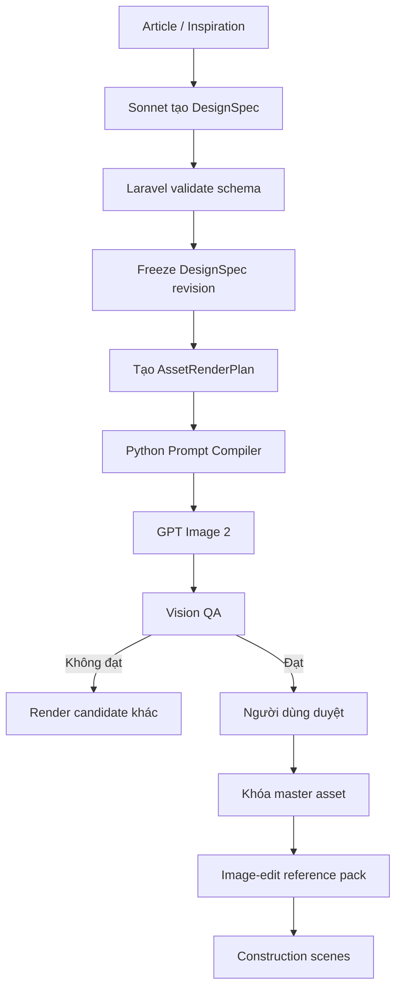

Chốt phương án production-grade như sau:

> **Sonnet tạo DesignSpec → Laravel kiểm tra, lưu và đóng băng → Python compile prompt theo loại asset → GPT Image 2 render → Vision QA chấm → Laravel duyệt và khóa anchor.**

Python không được tự sáng tạo lại thiết kế, không tự đổi số tầng, hình dáng mũi hoặc số scene.

## 1. Luồng xử lý tổng thể



---

# 2. Sonnet DesignSpec

Sonnet chỉ tạo **semantic design specification**, không viết prompt render.

## JSON contract

```json
{
  "schema_version": "1.0",
  "object_type": "superyacht",
  "design_thesis": "One continuous external shell integrates the hull and five readable internal deck levels.",
  "dimensions": {
    "length_m": 124,
    "beam_m": 16.76,
    "length_to_beam_ratio": 7.4,
    "draft_m": 4.6,
    "freeboard_midships_m": 3.8,
    "deck_to_deck_height_m": 2.9
  },
  "permanent_geometry": {
    "bow": {
      "stem": "near_plumb",
      "rake_degrees": 12,
      "waterline_entry": "fine",
      "forefoot": "continuous_convex_transition",
      "chine": "hard_chine_to_midships"
    },
    "hull": {
      "type": "steel_displacement",
      "sheer": "continuous_gentle_rise_toward_bow",
      "midbody": "full_displacement",
      "keel": "continuous_central_baseline"
    },
    "stern": {
      "type": "plumb_full_beam_transom",
      "platform": "integrated_recessed_waterline_platform",
      "overhang": false
    },
    "superstructure": {
      "envelope": "one_continuous_primary_shell",
      "enclosed_deck_levels": 5,
      "massing_position": "central_aft",
      "long_foredeck": true,
      "external_read": "single_integrated_mass",
      "tier_rule": "five floor levels remain verifiable without reading as five independent slabs"
    },
    "openings": {
      "superstructure_bands": 5,
      "language": "horizontal_flush_ribbon_apertures",
      "configuration": "recessed_inside_shared_external_shell",
      "hull_openings": "sparse_service_openings"
    }
  },
  "form_relationships": {
    "governing_line": "One uninterrupted sheer connects the stem, hull and superstructure envelope.",
    "massing_rhythm": "The envelope remains longest and lowest forward, gains volume amidships and contracts toward the stern.",
    "feature_integration": "Openings and recesses are subtracted from the continuous shell."
  },
  "finished_materials": {
    "hull": {
      "material": "marine_grade_steel",
      "colour": "satin_graphite"
    },
    "superstructure": {
      "material": "marine_grade_aluminium",
      "colour": "warm_off_white"
    },
    "glazing": {
      "type": "flush_dark_glass"
    }
  },
  "invariants": [
    "length_to_beam_ratio",
    "bow_geometry",
    "stern_geometry",
    "continuous_sheer",
    "superstructure_envelope",
    "enclosed_deck_level_count",
    "opening_layout"
  ]
}
```

## Laravel DTO

```php
final readonly class DesignSpecData
{
    public function __construct(
        public string $schemaVersion,
        public string $objectType,
        public string $designThesis,
        public array $dimensions,
        public array $permanentGeometry,
        public array $formRelationships,
        public array $finishedMaterials,
        public array $invariants,
    ) {}
}
```

## Validator Laravel

```php
final class DesignSpecValidator
{
    public function validate(array $spec): void
    {
        Validator::make($spec, [
            'schema_version' => ['required', 'string'],
            'object_type' => ['required', 'in:superyacht'],
            'design_thesis' => ['required', 'string', 'max:240'],

            'dimensions.length_m' => ['required', 'numeric', 'between:40,180'],
            'dimensions.beam_m' => ['required', 'numeric', 'gt:0'],
            'dimensions.length_to_beam_ratio' => [
                'required',
                'numeric',
                'between:4.5,8.5',
            ],
            'dimensions.draft_m' => ['required', 'numeric', 'gt:0'],

            'permanent_geometry.bow' => ['required', 'array'],
            'permanent_geometry.hull' => ['required', 'array'],
            'permanent_geometry.stern' => ['required', 'array'],

            'permanent_geometry.superstructure.enclosed_deck_levels' => [
                'required',
                'integer',
                'between:1,8',
            ],

            'permanent_geometry.openings.superstructure_bands' => [
                'required',
                'integer',
                'between:1,8',
            ],

            'invariants' => ['required', 'array', 'min:5'],
        ])->validate();

        $calculatedRatio =
            $spec['dimensions']['length_m'] /
            $spec['dimensions']['beam_m'];

        if (abs(
            $calculatedRatio -
            $spec['dimensions']['length_to_beam_ratio']
        ) > 0.08) {
            throw ValidationException::withMessages([
                'dimensions' => 'Length, beam and ratio are inconsistent.',
            ]);
        }
    }
}
```

---

# 3. AssetRenderPlan do Laravel tạo

Laravel quyết định asset nào phải render và dependency của nó.

```json
{
  "plan_id": "arp_01",
  "design_spec_revision": 3,
  "design_spec_sha256": "abc123",
  "candidate_policy": {
    "geometry_candidates": 4,
    "require_human_approval": true
  },
  "assets": [
    {
      "asset_code": "master_vessel_geometry",
      "asset_type": "master_vessel_geometry",
      "generation_mode": "generate_from_text",
      "reference_roles": [],
      "camera_profile": "identity_port_bow_3q",
      "state_profile": "advanced_fabrication",
      "blocked_by": []
    },
    {
      "asset_code": "master_vessel_finished",
      "asset_type": "master_vessel_finished",
      "generation_mode": "identity_preserving_edit",
      "reference_roles": [
        {
          "role": "geometry_identity",
          "source_asset": "master_vessel_geometry"
        }
      ],
      "camera_profile": "identity_port_bow_3q",
      "state_profile": "finished",
      "blocked_by": [
        "master_vessel_geometry.approved"
      ]
    },
    {
      "asset_code": "environment_anchor",
      "asset_type": "environment_anchor",
      "generation_mode": "generate_from_text",
      "reference_roles": [],
      "camera_profile": "construction_hall_master",
      "state_profile": "empty_shipbuilding_hall",
      "blocked_by": []
    }
  ]
}
```

Laravel phải đóng băng:

```php
final class FreezeAssetRenderPlan
{
    public function execute(VideoProject $project, array $plan): void
    {
        DB::transaction(function () use ($project, $plan) {
            $canonical = json_encode(
                $plan,
                JSON_UNESCAPED_SLASHES | JSON_UNESCAPED_UNICODE
            );

            $project->renderPlans()->create([
                'revision' => $project->next_render_plan_revision,
                'status' => 'frozen',
                'plan_json' => $plan,
                'plan_sha256' => hash('sha256', $canonical),
                'frozen_at' => now(),
            ]);
        });
    }
}
```

---

# 4. Python Prompt Compiler

Python nhận:

```python
CompileRequest(
    design_spec,
    asset_plan,
    camera_profile,
    state_profile,
    resolved_references
)
```

Nó không nhận prose tự do từ Sonnet để chuyển thẳng sang provider.

## Cấu trúc thư mục

```text
render_runtime/
├── contracts/
│   ├── design_spec.py
│   ├── asset_render_plan.py
│   └── compiled_prompt.py
├── compiler/
│   ├── prompt_compiler.py
│   ├── invariant_compiler.py
│   ├── camera_compiler.py
│   ├── state_compiler.py
│   ├── reference_compiler.py
│   └── avoid_compiler.py
├── profiles/
│   ├── cameras.py
│   ├── asset_types.py
│   └── construction_states.py
├── providers/
│   └── gpt_image_adapter.py
├── validation/
│   ├── prompt_validator.py
│   └── vision_qa.py
└── artifacts/
    └── ledger.py
```

## Data model Python

```python
from dataclasses import dataclass
from typing import Literal


AssetType = Literal[
    "master_vessel_geometry",
    "master_vessel_finished",
    "environment_anchor",
    "reference_view",
    "construction_state",
]


@dataclass(frozen=True)
class ReferenceInput:
    role: str
    asset_id: str
    path: str
    sha256: str


@dataclass(frozen=True)
class CompileRequest:
    asset_type: AssetType
    generation_mode: Literal[
        "generate_from_text",
        "identity_preserving_edit",
    ]
    design_spec: dict
    asset_plan: dict
    camera_profile: dict
    state_profile: dict
    references: tuple[ReferenceInput, ...]
```

---

# 5. Compiler theo từng loại asset

```python
class PromptCompiler:
    def compile(self, request: CompileRequest) -> str:
        sections = [
            self._generation_mode(request),
            self._input_images(request),
            self._primary_request(request),
            self._identity_invariants(request),
            self._silhouette(request),
            self._camera(request),
            self._subject_state(request),
            self._openings(request),
            self._materials(request),
            self._environment(request),
            self._lighting(request),
            self._hard_constraints(request),
            self._avoid(request),
            self._output_intent(request),
        ]

        prompt = "\n\n".join(
            section.strip()
            for section in sections
            if section and section.strip()
        )

        PromptValidator().validate(prompt, request)
        return prompt
```

## Routing

```python
ASSET_COMPILATION_POLICY = {
    "master_vessel_geometry": {
        "include_finished_materials": False,
        "include_fabrication_state": True,
        "include_environment_identity": False,
        "maximum_avoid_items": 12,
    },
    "master_vessel_finished": {
        "include_finished_materials": True,
        "include_fabrication_state": False,
        "include_environment_identity": False,
        "maximum_avoid_items": 12,
    },
    "environment_anchor": {
        "include_vessel_identity": False,
        "include_finished_materials": False,
        "include_environment_identity": True,
        "maximum_avoid_items": 10,
    },
    "reference_view": {
        "include_finished_materials": True,
        "include_identity_reference": True,
        "maximum_avoid_items": 10,
    },
    "construction_state": {
        "include_identity_reference": True,
        "include_previous_state": True,
        "include_construction_delta": True,
        "maximum_avoid_items": 15,
    },
}
```

---

# 6. Ba prompt compiler chính

## A. `master_vessel_geometry`

Chỉ compile:

* permanent geometry;
* silhouette;
* camera;
* openings dưới dạng cut-out;
* fabrication state;
* studio background;
* lỗi hình học quan trọng.

Không compile màu hoàn thiện, kính, teak hoặc trang thiết bị.

```python
def compile_geometry_state(spec: dict) -> str:
    return """
SUBJECT STATE

Advanced structural fabrication. The hull shell, primary decks and
superstructure shell are structurally complete but entirely unoutfitted.

Exterior plating is bare fabricated metal with restrained weld seams,
plate boundaries, grinding marks and controlled red-oxide primer patches.

Every permanent glazing aperture exists in its final position and final
proportion as an empty unglazed opening.

No installed glass, finished coating, railings, mast, antennas, deck
furniture or interior fit-out.
""".strip()
```

## B. `master_vessel_finished`

Bắt buộc dùng ảnh geometry đã duyệt.

```python
def compile_finished_mode(request: CompileRequest) -> str:
    return """
GENERATION MODE

Identity-preserving edit using the supplied approved geometry reference.

Use Image 1 as the permanent geometry authority. Preserve its hull length,
beam, bow, stern, sheer, chine, superstructure envelope, deck-level count,
deck breaks and every permanent opening location.

Change only the fabrication state into the declared finished exterior
condition. Do not redesign, beautify, reinterpret or replace the vessel.
""".strip()
```

## C. `environment_anchor`

Không đưa toàn bộ DesignSpec tàu vào.

```python
def compile_environment_anchor(environment: dict) -> str:
    return """
PRIMARY REQUEST

Render one empty enclosed superyacht construction hall establishing the
permanent environment geometry and camera position for later scenes.

The image is an environment and camera anchor, not a vessel-design image.
No vessel, hull section, fabricated yacht component or temporary construction
state is present.
""".strip()
```

Như vậy GPT Image không vô tình tạo một con tàu khác trong ảnh bối cảnh.

---

# 7. Compile `INPUT IMAGES`

```python
def compile_input_images(references: tuple[ReferenceInput, ...]) -> str:
    if not references:
        return ""

    lines = ["INPUT IMAGES"]

    for index, reference in enumerate(references, start=1):
        lines.append(
            f"- Image {index}: {describe_role(reference.role)}"
        )

    return "\n".join(lines)
```

Role mapping:

```python
REFERENCE_ROLE_TEXT = {
    "geometry_identity": (
        "approved permanent vessel geometry authority; preserve its hull, "
        "bow, stern, sheer, superstructure envelope and opening layout"
    ),
    "finished_identity": (
        "approved finished appearance authority; preserve its colours, "
        "materials, glazing and exterior finish"
    ),
    "environment_camera": (
        "approved construction-hall geometry, berth alignment, lighting "
        "and camera-composition authority"
    ),
    "previous_state": (
        "immediately preceding construction state and primary composition "
        "reference; retain every completed component"
    ),
}
```

---

# 8. Construction state dùng delta, không mô tả lại toàn bộ tàu

```json
{
  "state_code": "vertical_frames",
  "present": [
    "bottom_shell_plating",
    "keel_structure",
    "bottom_longitudinal_girders",
    "vertical_transverse_frames"
  ],
  "add_now": [
    "vertical_transverse_frames"
  ],
  "keep_unchanged": [
    "bottom_shell_plating",
    "keel_structure",
    "bottom_longitudinal_girders",
    "hall_geometry",
    "camera"
  ],
  "must_be_absent": [
    "side_shell_plating",
    "internal_bulkheads",
    "main_deck",
    "superstructure",
    "glass",
    "paint"
  ]
}
```

Compiler:

```python
def compile_construction_delta(state: dict) -> str:
    return f"""
CURRENT CONSTRUCTION STATE

Present:
{bullet_list(state["present"])}

ONLY CHANGE FROM THE PREVIOUS STATE

Add:
{bullet_list(state["add_now"])}

KEEP UNCHANGED

{bullet_list(state["keep_unchanged"])}

MUST REMAIN ABSENT

{bullet_list(state["must_be_absent"])}
""".strip()
```

Đây là điểm quan trọng để tránh GPT Image:

* dựng vách quá sớm;
* làm mất kết cấu scene trước;
* biến khung thẳng đứng thành khung vòm;
* thay đổi hình mũi;
* tự thêm thượng tầng.

---

# 9. Prompt Validator

Giới hạn 8.000–14.000 ký tự là **mục tiêu biên dịch**, không phải luật tuyệt đối của GPT Image.

```python
class PromptValidator:
    MIN_TARGET_CHARS = 8_000
    MAX_TARGET_CHARS = 14_000
    HARD_MAX_CHARS = 18_000

    def validate(
        self,
        prompt: str,
        request: CompileRequest,
    ) -> None:
        if len(prompt) > self.HARD_MAX_CHARS:
            raise ValueError(
                f"Compiled prompt is too long: {len(prompt)} characters"
            )

        required_sections = {
            "PRIMARY REQUEST",
            "PERMANENT GEOMETRY",
            "COMPOSITION / CAMERA",
            "HARD CONSTRAINTS",
            "AVOID",
            "OUTPUT INTENT",
        }

        missing = [
            section
            for section in required_sections
            if section not in prompt
        ]

        if missing:
            raise ValueError(
                f"Missing prompt sections: {', '.join(missing)}"
            )

        if request.generation_mode == "identity_preserving_edit":
            if not request.references:
                raise ValueError(
                    "Identity-preserving edit requires reference images"
                )

            if "INPUT IMAGES" not in prompt:
                raise ValueError(
                    "Reference roles were not compiled into the prompt"
                )
```

Cũng nên kiểm tra các xung đột:

```python
CONFLICT_RULES = [
    ("entirely unfinished", "installed finished glazing"),
    ("no water", "floating at sea"),
    ("empty construction hall", "workers"),
    ("generate from text", "preserve Image 1"),
]
```

---

# 10. GPT Image adapter

```python
import hashlib
import json
import time


class GptImageAdapter:
    def render(
        self,
        prompt: str,
        size: str,
        quality: str,
        input_images: list[str],
    ) -> dict:
        request_payload = {
            "model": "gpt-image-2",
            "quality": quality,
            "size": size,
            "prompt": prompt,
        }

        started = time.perf_counter()

        result = self.client.images.edit(
            **request_payload,
            image=input_images,
        ) if input_images else self.client.images.generate(
            **request_payload
        )

        elapsed_ms = round(
            (time.perf_counter() - started) * 1000
        )

        image_bytes = decode_image(result)
        prompt_bytes = prompt.encode("utf-8")

        return {
            "provider": "openai",
            "model": "gpt-image-2",
            "quality": quality,
            "prompt": prompt,
            "prompt_sha256": hashlib.sha256(
                prompt_bytes
            ).hexdigest(),
            "requested_size": parse_size(size),
            "actual_size": inspect_image_size(image_bytes),
            "format": inspect_format(image_bytes),
            "bytes": len(image_bytes),
            "elapsed_ms": elapsed_ms,
            "output_sha256": hashlib.sha256(
                image_bytes
            ).hexdigest(),
        }
```

Lưu ý: `actual_size`, `bytes`, `elapsed_ms` và `output_sha256` chỉ được ghi **sau khi render**. Không được Sonnet hoặc Laravel đoán trước.

---

# 11. Vision QA

Không nhồi tiêu chí đo lường vào provider prompt. Chuyển chúng sang QA contract.

```json
{
  "asset_type": "master_vessel_geometry",
  "checks": [
    {
      "code": "single_superyacht",
      "type": "count",
      "expected": 1,
      "hard_gate": true
    },
    {
      "code": "bow_left",
      "type": "orientation",
      "expected": true,
      "hard_gate": true
    },
    {
      "code": "port_side_visible",
      "type": "visibility",
      "expected": true,
      "hard_gate": true
    },
    {
      "code": "enclosed_deck_levels",
      "type": "count",
      "expected": 5,
      "hard_gate": true
    },
    {
      "code": "continuous_shell",
      "type": "classification",
      "expected": true,
      "hard_gate": true
    },
    {
      "code": "wedding_cake_massing",
      "type": "defect",
      "expected": false,
      "hard_gate": true
    },
    {
      "code": "installed_glazing",
      "type": "defect",
      "expected": false,
      "hard_gate": true
    },
    {
      "code": "complete_subject_in_frame",
      "type": "framing",
      "expected": true,
      "hard_gate": true
    }
  ]
}
```

Kết quả:

```json
{
  "passed": false,
  "score": 0.78,
  "hard_failures": [
    "enclosed_deck_levels",
    "wedding_cake_massing"
  ],
  "observations": {
    "detected_deck_levels": 4,
    "bow_orientation": "left",
    "subject_count": 1
  }
}
```

Ảnh fail hard gate không được trở thành anchor, dù nhìn đẹp.

---

# 12. Chính sách tạo và khóa `master_vessel`

Laravel tạo bốn candidate:

```php
foreach (range(1, 4) as $candidateIndex) {
    RenderAssetJob::dispatch(
        assetCode: 'master_vessel_geometry',
        candidateIndex: $candidateIndex,
        planRevision: $renderPlan->revision,
    );
}
```

Trạng thái:

```text
planned
→ compiling
→ rendering
→ validating
→ qa_passed
→ awaiting_approval
→ approved
→ locked
```

Khóa anchor:

```php
final class ApproveMasterAsset
{
    public function execute(Render $render, Admin $admin): void
    {
        DB::transaction(function () use ($render, $admin) {
            if ($render->qa_status !== 'passed') {
                throw new DomainException(
                    'A render that failed QA cannot become a master asset.'
                );
            }

            Asset::query()
                ->where('project_id', $render->project_id)
                ->where('asset_type', $render->asset_type)
                ->where('status', 'locked')
                ->lockForUpdate()
                ->get();

            $render->asset->update([
                'status' => 'locked',
                'approved_render_id' => $render->id,
                'approved_by' => $admin->id,
                'approved_at' => now(),
                'locked_revision' => $render->plan_revision,
                'locked_sha256' => $render->output_sha256,
            ]);
        });
    }
}
```

---

# 13. Database tối thiểu

| Table              | Vai trò                                      |
| ------------------ | -------------------------------------------- |
| `design_specs`     | JSON chuẩn do Sonnet tạo                     |
| `render_plans`     | Kế hoạch đã freeze                           |
| `assets`           | Asset logic: geometry, finished, environment |
| `asset_references` | Quan hệ input ảnh và role                    |
| `render_attempts`  | Mỗi candidate hoặc retry                     |
| `prompt_artifacts` | Prompt đầy đủ, hash, compiler version        |
| `qa_results`       | Kết quả Vision QA                            |
| `review_decisions` | Người dùng duyệt hoặc từ chối                |

Các trường quan trọng trong `prompt_artifacts`:

```text
id
project_id
render_attempt_id
design_spec_revision
render_plan_revision
compiler_version
template_version
prompt
prompt_sha256
input_manifest_json
created_at
```

Các trường quan trọng trong `render_attempts`:

```text
id
asset_id
candidate_index
provider
model
quality
requested_size
actual_width
actual_height
output_path
output_sha256
bytes
elapsed_ms
status
claim_token
plan_revision
created_at
```

---

# 14. Quyết định cuối cùng về trách nhiệm

| Thành phần  | Trách nhiệm                                                      |
| ----------- | ---------------------------------------------------------------- |
| Sonnet      | Thiết kế và trả `DesignSpec`                                     |
| Laravel     | Validate, revision, freeze, dependency, approval, khóa anchor    |
| Python      | Resolve ảnh, compile prompt, gọi provider, lưu artifact kỹ thuật |
| GPT Image 2 | Render hoặc image-edit                                           |
| Vision QA   | Kiểm kết quả theo contract                                       |
| Người dùng  | Duyệt candidate canonical                                        |
| FFmpeg      | Ghép video cuối                                                  |

Đây là phương án nên chốt. Điểm cốt lõi là **không còn một “prompt Sonnet gửi thẳng cho GPT Image”**. Sonnet tạo sự thật thiết kế; Laravel quản lý sự thật đó; Python chỉ biên dịch đúng lát cắt cần thiết cho từng ảnh.
